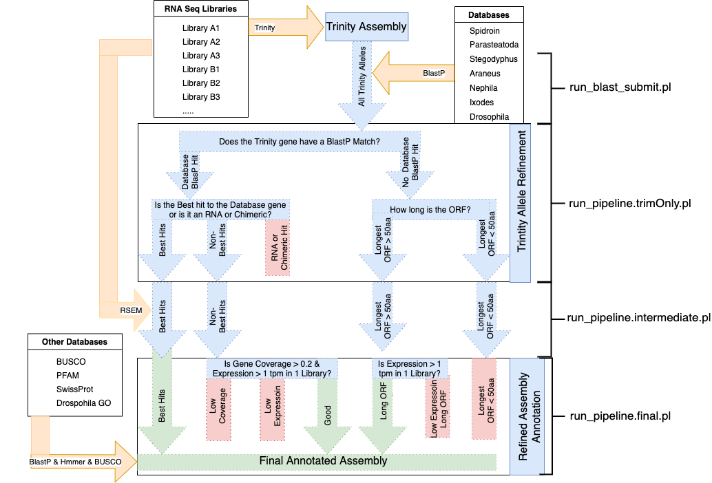

# TrTAP README and Installation
## Introduction
Transcriptome Trimming and Annotation Pipeline is a series of perl scripts designed to work with several standard bioinformatic tools to successfully classify the transcripts within a de novo transcriptome to select the most supported isoforms and alleles and to remove any poorly supported transcripts; and then to annotate the remaining transcripts.

The current setup here is designed for Aranchnids but blast databases from other phyla can be substituted in.




## Required 
### Programs
 - NCBI Blast (blastx, blastp, and blastn)
 - Bowtie and Bowtie2
 - RSEM
 - HMMer
 - BUSCO
 - tRNAscan
 
### Data
 -  Read Files
 -  Trinity Assembly
 	- *Trinity files can be generated from the read files*
 -  Blast Databases
    - The below databases are included in the github repository. It is possible to add additional databases. They should be placed in the same directory and the id placed in the ranking file.
 
 | Name | Description |  
 | ---- | ----------- |
 | SpidTerm | Terminal region of Spidroins from Argiope |
 | Fly | Drosophila proteins from Flybase |
 | Ixo | Tick proteins from Tick Genome |
 | Smim | Stegodyphus mimulus proteins |
 | Ptep | Parasteadota tepidariorum proteins |
 | Avent | Araneus ventricosus proteins |
 | Neph | Nephila clavipes proteins |
 | SILVA_132.AllrRNA.fasta | SILVA Arthropod 18S rRNA file |
 
 - ranking file
   - *contains the ranking of how TrTAP scripts treat the blast results from the databases above*
   - This is also included in the github repository with the above 

## Usage

These scripts take a Trinity Assembly and through the scripts it trims the assembly to identify high confidence proteins and to annotate these.

The following is a description of running the pipeline in TrTAP_SCRIPT_DIR on TRINITY_ASSEMBLY created from the read files in READ_DIR that end in READ_END. The blast databases are found in BLAST_DB. The files are written in RESULT_DIR with the header of GENOME_ID.
```
cd TrTAP_SCRIPT_DIR
perl run_blast_submit.pl -t TRINITY_ASSEMBLY -b BLAST_DIR -o RESULT_DIR -r -f READ_DIR -i GENOME_ID -c Fly -k 
perl run_pipeline.trimOnly.pl -t TRINITY ASSEMBLY -b BLAST_DIR -r RESULT_DIR -c Avant -o RESULT_DIR -g GENOME_ID -x GENOME_ID_CHIMERA.40.txt
perl run_pipeline.intermediate.pl -t READ_DIR -e READ_END -r RESULT_DIR -o RESULT_DIR -k
perl run_pipeline_final.pl -b BLAST_DIR -r RESULT_DIR -g GENOME_ID_NEW -i GENOME_ID -m GENOME_ID_INT_ALL > RESULT_DIR/GENOME_ID_FIN_TRIM.gene_info.out
```

### Initialization

TrTAP uses a config file **trtap.ini** to set up the locations of the programs and set them in the PATH environmental variables for the slurm commands. Below is listed all the variables defined in the config file:

 | Name | Description | Variable | 
 | ---- | ----------- |----------|
 | blast | location of the NCBI blast executables| set $PATH to include ncbi-blast+ bin|
 | rsem | location of the rsem executables| set $PATH to include rsem bin|
 | bowtie| location of the bowtie executables | set $PATH to include bowtie bin|
 | bowtie2 | location of the bowtie2 executables | set $PATH to include the bowtie2 bin|
 | diamond | location of the diamond executable and databases| set $PATH to include diamond and $DIAMOND_DB to include nr|
 | tRNAscan | location of the tRNAscan executable | set $PATH to include tRNAscan | 
 | busco | location of the busco executables | set $PATH to include run_BUSCO.py|
 | hmmer | location of the hmmer executables | set $PATH to include hmmscan|
 | pfam | location of the pfam databases | set $PFAM_DB to include path of Pfam-A.hmm|
 | uniprot | location of the swissprot databases| set $UNIPROT_DB to include path of uniprot_sprot.fasta |
 | perl | location of the perl executables | set $PATH to include perl bin with the BIOPERL link|
 | python3 | location of the python executables | set $PATH to include the python3 bin|
 

### run_blast_submit.pl 
Submits all the blast runs against the Trinity Assembly to SLURM that the subsequent files use to trim the assembly using the blast databases in the database directory. Additionally the program creates a RSEM database and runs the RSEM against all of the read directory.
```
perl run_blast_submit.pl 
Submits blast runs to SLURM job submissions
-----------------USAGE--------------
 -t Trinity Assembly (Required)
 -b blast directory (Required)
 -e email address. Default = 0
 -o output directory. Default is the current directory
 -n number to split into. Default = 0
 -x run a test. Does not submit . Default = 0
 -f fastq directory to run paired end RSEM.
 -i for the output header to the sequence
 -c database to run the chimera test on
 -k skip nr run
 -r also runs rrna and trna searchs
 -m add time to run

```

### run_pipeline.trimOnly.pl
Once the SLURM runs from run_blast_submit.pl are finished, the "best" contig of the Trinity assembly is selected using the blast results, using the ranked databases from the ranking.txt file. Additionally when available, Chimeric and RNA sequences are removed from the intermediate results. The intermediate peptide, coding, and nucleotide files as well as an information table is returned with the ID addition of _INT_TRIM added to the genome id.
```
Runs Annotation and Translation on a Trinity Sample

-----------------USAGE--------------
 -t Trinity Assembly (Required)
 -b blast directory
 -r results directory
 -c closest genome. Required 
 -o output directory. Default is the current directory
 -g genome id. Default = GEN
 -e evalue cutoff. Default is 1e-5
 -s species evalue cutoff. Default is the e-value
 -x chimera file. Default is expected _CHIMERA.txt
 -z full chimeric file. No default
```

### run_pipeline.intermediate.pl
Using the trimmed files, the secondary annotation scripts are submitted to SLURM, including making RSEM and bowtie2 matrices. PFAM and UniProt are used to add more general annotation including GO terms.
```
Runs Annotation and Translation on a Trimmed Sample

-----------------USAGE--------------
 -t read file directory
 -e read file ending. Default is 
 -r results directory
 -o output directory. Default is the current directory
 -g genome id. Default = GEN
 -m memory for the run. Default = 40g
 -x skip bowtie2 runs
```


### run_pipeline_final.pl
Run after all the comparisons begun by the above script finishes, this finalizes the annotation by using the intermediate results in addition to the blasts to assign final categories to the transcripts. Additional annotation information including GO and GO Slim terms and expression values are also added to the final table. It can also create the rsem and bowtie matrices as needed to perform the final annotations.
```
Runs Post-Redundancy Removal Trimming and Annotation on a Trinity Sample

-----------------USAGE--------------
 -b database directory 
 -r results directory
 -o output directory. Default is the current directory
 -g genome id. Default = GEN
 -i intermediate id. Default = GEN
 -c gene coverage cutoff for good. Default = 0.2
 -m expression matrix ID. Default = intermediate ID.
 -e expression cutoff for good. Default = 1 FPKM
```
